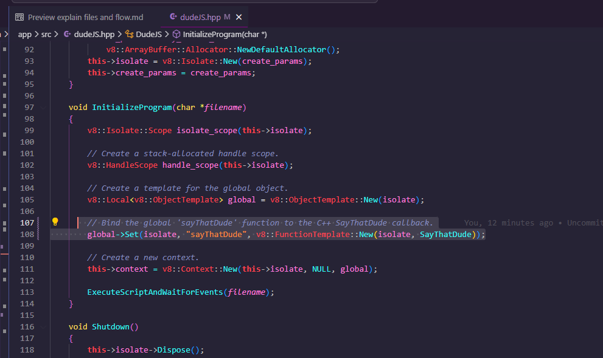
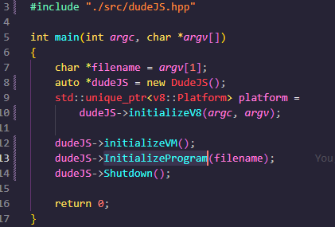

# How to run
- Use the environment with Gitpod snapshot (Sign in with your github and choose 'open VS code on Browser')
- Once open build by running command `make build`
- Run the index.js file by `make run`
- Try to use newly created custom function in index.js

## Explain makefile
Build stage will replace all the variable on line number 37 such as APP OBJ(executable monolith for v8 and libuv) INCLUDE(including header for v8) INCLUDEUV(including header for libuv) OUTPUT_FILE(path for output file) and will output the exectuable to ./bin folder. Also contains command for clean which just deletes bin

## Explain `make run` and nodemon
`nodemon -e cc,h,js,cpp,hpp --exec "make recompile && ./bin/dudeJS index.js"` watches all the files with cc,h,js,cpp,hpp and recompiles the project

## Explain v8 folder
We have monolith for v8 which we have generated and have copied headers in include. These are refereces for functions which are in binary. So in make file you are just using these headers. i.e. $$OBJ

## Explain libuv folder
We have monolith for libuv which we have generated and have copied headers in include. These are refereces for functions which are in binary. So in make file you are just using these headers. i.e. $$OBJ

## Explain app/index.cc
Here we call initializeV8, initializeVM, InitializeProgram and Shutdown when we done need it.

## Explain app/src/util.hpp
Copied some utilities from https://github.com/v8/v8/blob/master/samples/shell.cc for working with v8 ReportException for handling exception ToCString for string conversion

## Explain app/src/fs.hpp
Copied from https://github.com/v8/v8/blob/master/samples/shell.cc for reading files. Why do we read files cause we read files like index.js or whatever files we pass and eval i.e. execute the file. The copied method reads file in synchronous manner.

## Initialization flow 

Mostly the flow of program is like this.. 
- First we initialize V8, create scope, create context and then execute file i.e. 
  - Suppose the outlined portion is the converted file. 
  - so what happens behind scene is that file is kind of put into eval('the content of files') and executes it
  - Then it compiles it and execute and gets the result
- So while creating context we do this 
  - like you can see here on line no 107 we are binding SayThatDude function with `"sayThatDude"` so whenever v8 sees `sayThatDude` in js and it invokes `'SayThatDude'` of c++

- 
  - with `initializeVM` what we do is we are creating context and create an isolated env to run our code safely.

- After `initializeVM` we run `InitializeProgram` and pass fileName which is first argument like when we run `node index.js`, we actually pass the `index.js` as a first argument
  - 

- 
  - In `InitializeProgram` we create scope and create `global` object, to which we attatch our custom method to like we did here with `sayThatDude`
  - 
  - then we execute script i.e. `ExecuteScriptAndWaitForEvents`/ where we parse the file, compile it and run it. Then we wait for events 
  - in `WaitForEvents` we do nothing but start the event loop. `uv_run` does nothing but runs the event loop.
